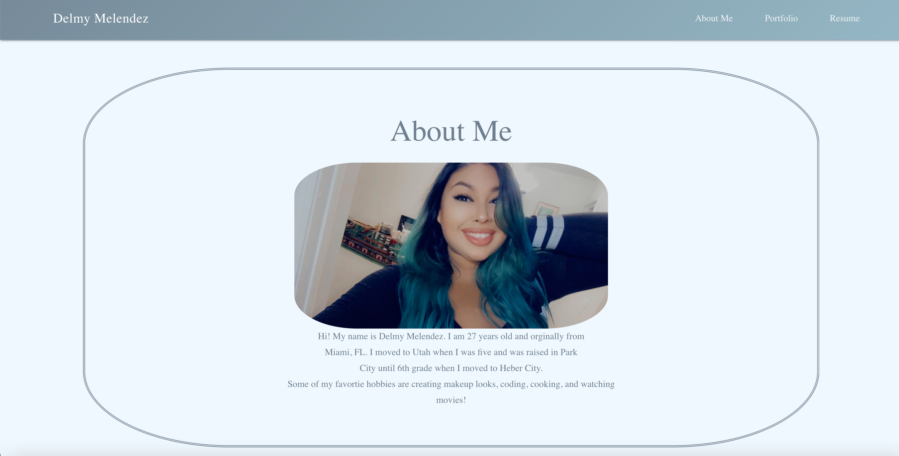

# Del.Mel-Homework-20-React-Portfolio

## Table of Contents
[Description](#description)  
[Installation](#Installation)  
[Test](#Testing)  
[Project Links](#Repo)  
[Contributors](#Contributors)  

## Description
* Simple portfolio created with react.

## Installation
* N/A

## Testing
* N/A

## Repo
* [Repo](https://github.com/delmymm/Del.Mel-Homework-20-React-Portfolio)
* [Live Site](https://delmymelendezport.netlify.app/)

## Contributors
* Contributor: [Delmy Melendez](https://github.com/delmymm)

## Acknowlegdements 
* Paul Hanna React Tutorial: (https://github.com/paulhanna1933/react-portfolio)